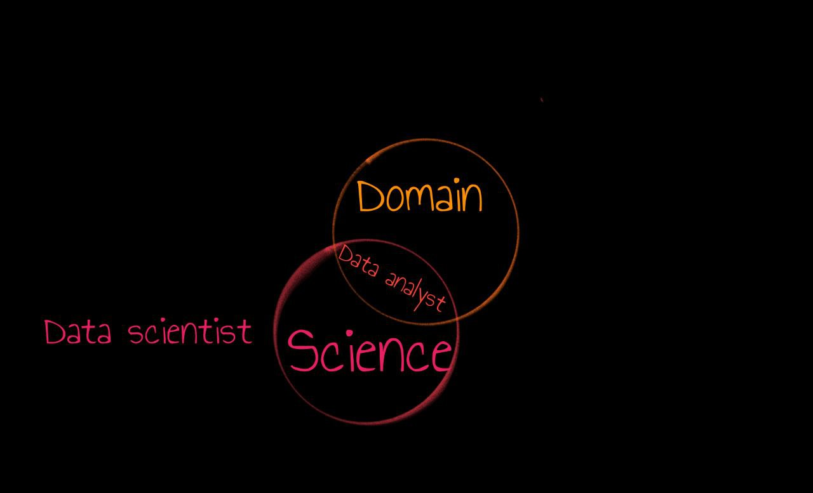
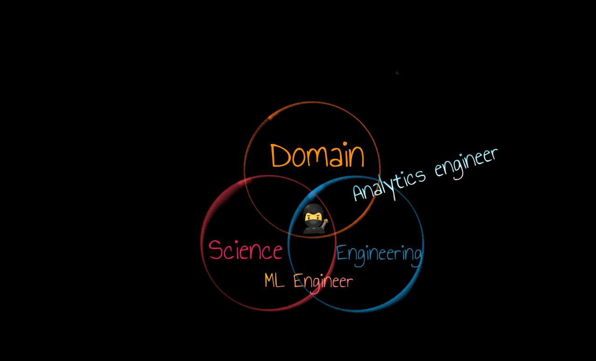

<!--
_class: lead
_paginate: false
_footer: ""
-->

<!--
_class: lead
_paginate: false
_footer: ""
-->
# A Data Ninja Rockstar 
# Is Not Enough

Jodie Burchell
Pasha Finkelshteyn

<!--
Hi everyone, we're happy to be presenting today at Big Data London!

Pasha introduction:
Jodie introduction:
I'm Dr. Jodie Burchell. I completed a PhD in psychology and a postdoc in biostatistics before moving into a career in data science.

Between the two of us, we have over a decade's experience working in data teams, and we'd like to use this talk to clear up some misconceptions we've seen about what it takes to make a successful data team, including the different responsibilities and skills that need to be covered, and who is best able to check these off.
-->

---

## Who works with data?

<!--
To get started, think of the first role that pops into your mind when you think of who works with data.
-->

---

## Who works with data?

Of course, data scientists!

<!--
For many people, this would be a data scientist. In fact, the myth of what data scientists can do with data has only grown over the years, with many companies imagining that if only they can hire one of these big brain PhDs they'll be making millions with AI products.
-->

---

## Who works with data?

Of course, data scientists! (not only)

<!--
Unfortuntately for these companies (and the ego of us data scientists), the picture is not that simple. Data scientists are not the only members of most data teams, and in many cases, may not be the core member, depending on what your company wants to do.
-->

---

# Reality is

Nobody should or even can do everything

Responsibilities should be distributed

Some responsibilities can be "outsourced" to SaaS's

<!--
In reality, unless you have a very small and early stage start up, no one person can or should do every task that falls under the data domain. We're going to describe in this talk how these responsibilities typically would be distributed in a mature data team. In addition, with the proliferation of tools in the data space, it's no longer necessary to do a lot of this work in house. We'll discuss some options for using SaaS's as an option for outsourcing some of this work. 
-->

---

# Example project

Setup: Large fashion e-com _Trasos_

Task: recommender system

<!--
To ground this talk a little, we're going to be using an example of a fairly typical problem that a data team might need to solve. Let's imagine that we work at a large fashion e-commerce called, I don't know, Trasos, and we'd like the data team to build a recommender system which suggests similar items to ones that they looked at or bought.
-->

---

# What business says:

- Increase retention
- Reduce cost of acquisition

<!--
The reason we want this recommender system is to retain customers that we already have, and also make it cheaper to get new customers ...
-->

---

<!-- _class: lead -->

# What business means?

Clients be like

<!--
... which we're hoping, of course, leads to more sales and more revenue. So you can see this is not some abstract data problem, but more one that will hopefully have an impact on the bottom line of the business.
-->

---

# Business outcomes

- It should be easier to convert non-customers to customers
- Customers should return sooner

<!--
Concretely, what we want this recommender system to be able to deliver is that it increases the rate of non-customers converting to customers, making this a cheaper way of acquiring new customers. In addition, we want to increase engagement and sales among existing and newly acquired customers.
-->

---

# Technical constraints

- Lots of simple events (clicks, scrolls, interactions)
- Backend is in Scala, but Data Science team works with Python

<!--
We also have a number of technical constraints which will affect our recommender project. Our data is massive and made up of a bunch of simple events, which will need to be processed and converted into metrics we can actually use to train and measure our model. In addition, our backend is written in Scala but our data science team works in Python, so any model the data science team comes up with will need to work within a Scala code base.
-->

---

# Approach

1. Define business questions 
1. Define required data
1. Prepare data
1. Research models
1. Productionise model
1. Monitor

<!--
So, now that we understand what the business needs and what our technical limitations are, let's get to spelling out exactly what needs to be done to implement this project. 

The first thing we need to do is concretely define the business question. How much do we need to improve acquisition and retention for this project to be a success? How are we going to measure it, and will we compare this with anything else, such as external advertising?

Once we've worked this out, we need to define what the required data is for building the models and measuring this impact. As we said, we have events, but we might also be able to use other properties of the clothing such as the size, the target wearer, the style or even the image itself.

Following that, we need to prepare this data, firstly creating samples for building the model, and then designing the pipelines that will be used when the recommender is productionised.

Next, we get to (for me) the fun part, which is researching models. The models that will be suitable depend on the data we have, how much time we have to experiment, how much uplift in retention and acquisition the business is expecting, and our technical constraints.

Once we've decided on a model that meets our criteria, we can productionise it, which includes plumbing up the data pipelines, serving the model, and making sure the results are implemented on the front end.

Finally, we need to build monitoring, which includes technical monitoring about how the data and the model is working, but also business reporting on how well the model is satisfying the business criteria.
-->

---

# Data components

<!--
Now this is a big list of work, and I think you can see it requires many different skills. We can broadly divide these skills up into three areas. The first of these is domain knowledge, which is having a deep understanding of what the business does, what the data is produces means, and what kind of things would help the business improve or succeed. Analysts are deep domain specialists.
-->

---

# Data components

<!--
The second area is science. This is using research skills in conjunction with data to answer open ended business questions or create useful data products. While data scientists tend spend most of their time in this domain, data analysts also need to do some research as part of their role.
-->

---

# Data components

<!--
The final area is engineering. Data engineering is concerned with the organisation, processing and storage of data, including making sure that the provinance of that data is understood and data is accessible by others that might need to use it. They may also be responsible for the deployment and maintenance of machine learning models. Data engineers with a deep domain knowledge are analytics engineers, who translate business needs into data models. People who have a command of data science and data engineering work are ML engineers, who are usually able to work on data science models and also understand how to get them into production.

Finally, at the intersection of all of these, we have our Data Ninja Rockstar, a person who we're asking to have a deep understanding of all of the business needs and current operations, excellent research skills and be a proficient engineer. Having spelled out all of the skills and responsibilities we might expect our Ninja Rockstar to have, you can see why they are true unicorns when it comes to hiring, especially for larger companies with more complex needs. In addition, you can also see that the amount of work needed to be completed by just one person is not really sustainable. As such, as you can probably guess from the title of the talk, we're going to caution against trying to hire this all-in-one person to do everything on your data team and instead describe the three specialisations that typically divide up this work.
-->

---

<!-- _class: lead -->
# <!-- fit --> The three specialisations

---

<!-- _class: lead -->

# <!-- fit --> Data Scientists

The research folk

<!--
The first pillar of the data team we're going to talk about are the data scientists, or the research folk.
-->

---

# Data scientist skills

* Ability to do research
* Statistics
* Machine/deep learning
* Programming
* Data wrangling and visualisation

<!--
A data scientist's core skill is the ability to do research: that is, take vague business questions or requirements and try to either find an answer or build a product to meet the need. In order to do so, they need to use statistics to get certainty about their answers, or know machine or deep learning techniques to build models. They also need to know how to do programming and data wrangling, but this is more in the service of doing research or POCs, not production-level code or ETLs. In addition, they need to be able to present their research using visualisations, but this is usually not at the level that data analysts would be doing for business consumers. 
-->

---

# Data scientist responsibilities

1. Translate business question
2. Research available data and make shortlist
3. Request sample from data engineering

<!--
What responsibilities would our data scientists have on our recommender project? Well, at the beginning, they would be responsible for working with the business stakeholders to work out if their request makes sense (is a recommender the best solution for this problem?) and communicate the estimated complexity of building the model.

They would then start by digging through all available data and putting together a shortlist of what looks like it could be useful for both building and evaluating the model. After that, depending on how hard the data is to access, the data scientist will either pull a sample of this data themselves or ask data engineering to do so.
-->

---

# Data scientist responsibilities

4. Modelling:
* Feature engineering
* Iteratively find suitable MVP
5. Define DoD for “production ready” in collaboration with DE team
6. Define model metrics, request monitoring

<!--
Of course, the data scientist will then start exploring the data, creating suitable features and building the first recommender. The success of the recommender model needs to be assessed using model metrics, such as how much coverage of the product catalogue the recommender achieves, as well as close it comes to achieving the acquisition and retention goals set by the business. The solution the data scientist uses is also constrained by the fact our backend is in Scala. For example, the data scientist might come up with a solution that can be implemented in pure Scala, such as finding approximate nearest neighbours, or they might plan use a model serving platform such as MLflow so need to come up with a model that is compatible. At this stage, the data scientist might also adjust their estimates of how long it will take to produce a recommender of sufficient quality, based on how well this first model performs. 

Finally, they will come up with a MVP recommender which meets both the business requirements and fits the technical constraints, and its time to hand over the model to the engineering team for deployment. 

Finally, the data scientist will request reporting of those same model metrics from the data engineering team so they can assess how well the model is going in production.
-->

---

<!-- _class: lead -->

# <!-- fit --> Data Engineers

The big data folk

---

# Data engineer responsibilities

Data:

* Events

---

# Data engineer responsibilities

Data preparation:

* Collection and storage (managing costs)
* Verification (data engineering, upstream customers)

---

# Data engineer responsibilities

Technical solution:

* Configuration
* Technical solution and choice

---

# Data engineer responsibilities

In production:

* Monitoring (ops)
* Provide access to suitable data to BI and DS

---

<!-- _class: lead -->

# <!-- fit --> BI Analysts

The data communication folk

<!--
The final pillar of the data team we're going to discuss is, of course, business intelligence analysts, the data communication folk.
-->

---

# BI analyst skills

* Deep understanding of business
* Knowledge of what data answers business questions
* Data communication and visualisation
* Data wrangling
* Data exploration and analysis

<!--
The core responsibility of the data analyst is to understand what information business people need to know about how the company is functioning and extract this from the data. They are therefore, as we've already said, deep experts in both the business domain and the available data. Much of their work concerns data communication, either through creating dashboards to monitor core business metrics, or adhoc reports to answer business questions, which requires very high level data visualisation skills. They are typically good at data cleaning, usually through tools like Excel or SQL, and are skilled at exploring and analysing this data.
-->

---

# BI analyst responsibilities

1. Understand feasibility of project
2. Define metrics for measuring business success
3. Request sample from data engineering

<!--
What responsibilities will our data analyst have on our recommender project? Well, they will work with business and data science to help understand if the retention and acquisition goals that we have are even feasible, based on past measures to improve these metrics. They'll also be able to find out the monetary impact of these improvements.

Once we've decided to go ahead with the recommender project and set our realistic business goals, the data analyst will need to define the metrics for to measure business success, and how to derive these from the raw data (if they don't already exist). Again, depending on how hard it is to access the data, they may pull a sample themselves or request one from the data engineering team.
-->

---

# BI analyst responsibilities

5. Request final pipelines from DE for reporting
6. Reporting on business success:
* Business metric dashboards
* Adhoc analyses (e.g., for marketing)

<!--
Once the recommender MVP is ready for production, the data analyst will work with data engineering to create pipelines for the data they need to monitor the recommender. In addition, they may define experiments in order to make their conclusions about the business impact of the new model more robust, such as only applying the recommender to part of the customer base in order to have a baseline to compare to. 

Following this, they will build dashboards using tools such as PowerBI or Tableau which keep track of how much the recommender is affecting acquisition, retention, and the subsequent impact on revenue. The analyst will be primarily responsible for monitoring these metrics and communicating with both business and data science if the model doesn't seem to be performing as expected. In addition, they may need to create adhoc analyses about the performance of the recommender, such as pulling the numbers for piece for marketing to show off the cool technology that Trasos is using.
-->

---

# Overlaps: Productionisation

* What is the definition of done for the finished model?
* Who is responsible when things go wrong?

<!--
Now, you might have realised there are a few areas where the separation between the roles is not so clear cut. We're going to go over a couple of them here, the first of which is "Who is responsible for what when the model goes into production?"

Now, I've worked on teams where the approach was everything from throw a Jupyter notebook over the fence and let engineer deal with it, to data science wrote the app to deploy the model so they're on pager duty, and I can tell you that neither extreme works that well. Instead, there is a large grey area which needs to be negotiated between your data science and data engineering teams, depending on how much the skills and interests of both overlap between science and engineering. 

There should be a prearranged definition of done by the data science team for the model and its associated code and artefacts, and an understanding what will be changed by the data engineering team. My general feeling is that whoever needs to be responsible for debugging this model in production should be the one who writes the code for it. So if your model is going to be served from MLflow, for instance, it might be better if your data scientists wrote the code for the model, but if the code is able to be written in Scala, then obviously your data engineering team needs to translate the code from Python at that point with the help of the data science team.

However, obviously a model doesn't exist in isolation. The data that is fed into a model in production is going to be the responsibility of the data engineering team, who will create efficient ETLs to produce this data in the most cost-effective way. Models also need resourcing, and the ops team will be responsible for this, for example, making sure that sufficient pods with enough memory in the right data centres are available to allow the model to run efficiently.

Another area where there will be overlap is when things go wrong. One of the reasons we've emphasised having a division of monitoring is so that the right team with the right expertise can spot problems in a timely manner. For example, the data science monitoring might show a massive drop in model performance, or the data engineering monitoring might show a huge drop off in events used for the model. Once the problem is found, it's likely going to be an exploratory process to diagnose it, which will involve multiple people from multiple teams, from data analysis through to the ops team.

In the best case scenario, the problem has a quick solution. However, in the worst case, the model needs major changes. [Tell BMW story here?] These changes should be treated with the same scrutiny as the decision to do the initial project was, as they may end up being a large commitment to implement.
-->

---

# Summary

1. There are lots of responsibilities around data
2. These responsibilities are broad
4. You need to split your work between 3 dimensions
5. Hire team accordingly

---

<!-- _class: lead -->

# <!-- fit --> Thank you!

Twitter: @asm0di0

Blog: t-redactyl.io 
Twitter: @t-redactyl