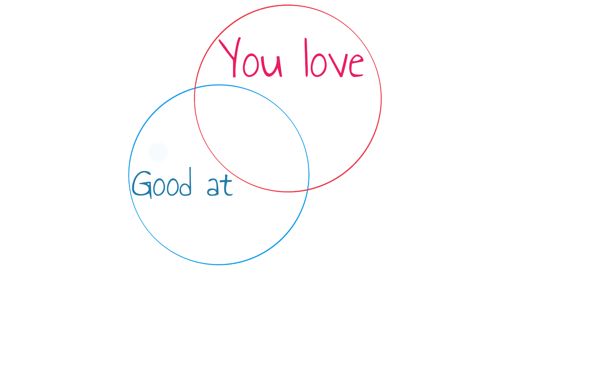
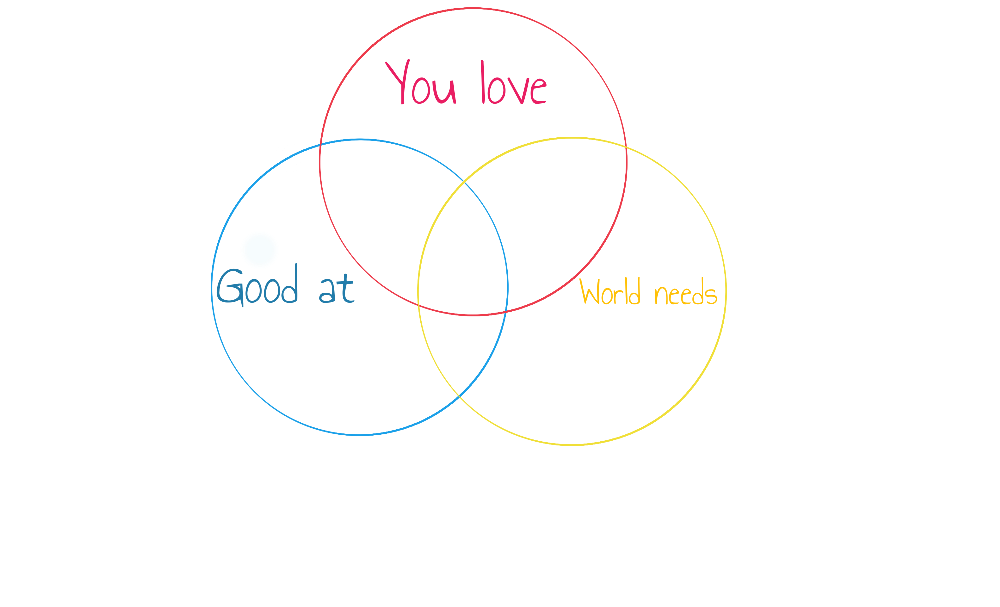
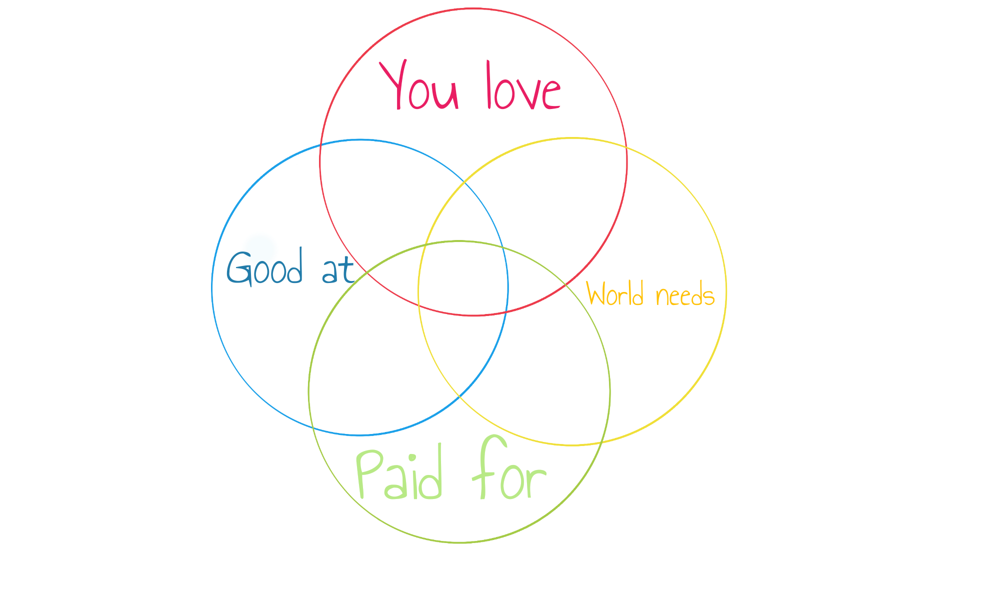
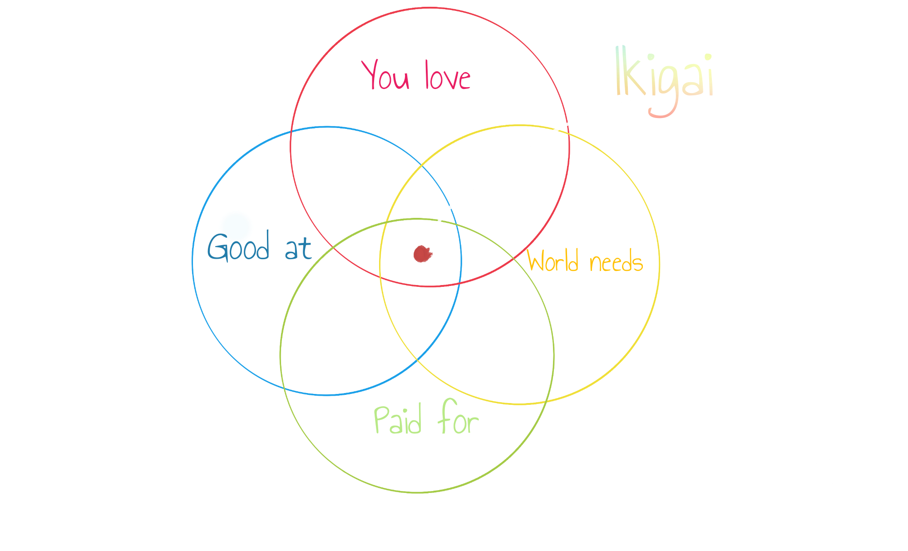
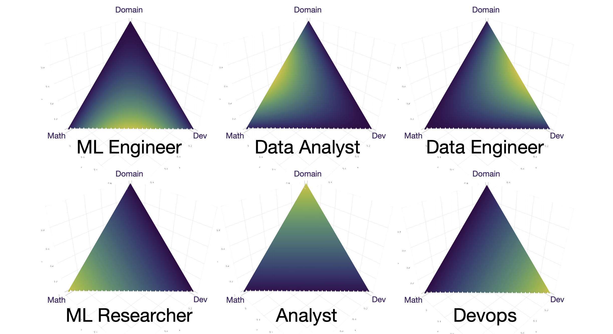

<!--
_class: lead
_paginate: false
_footer: ""
-->
# <!-- fit --> How do we know where to work?

---

---

---

---

---

---

<!-- _class: lead -->

# Ikigai

> Ikigai (生き甲斐, lit. 'a reason for being') is a Japanese concept referring to something that gives a person a sense of purpose, a reason for living.

<small>Wikipedia, the most reliable source of valid data</small>

---

<!--
_class: lead
_paginate: false
_footer: ""
-->
# DE, DS, and others
## Find your Ikigai

Jodie Burchell
Pasha Finkelshteyn

---

# What is Big Data?

* Data that won't fit a single node
* Data that scales on 3V
    * Velocity
    * Variety
    * Volume
* Data on which we can make reliable business decisions

---

## Who works with data?

---

## Who works with data?

Of course, data scientists!

---

## Who works with data?

Of course, data scientists! (no)

---

# Who works with Data

* ML Engineers
* Data Analysts
* Data Engineers
* ML Researchers
* Analyst
* More is coming?

---

---

